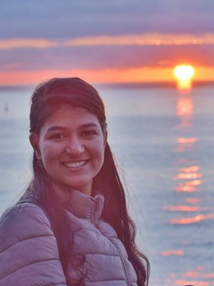

  <a href="index.html" class="active">Home</a>
  <a href="resume.html">Resume</a>
  <a href="blogs.html">Blogs</a>

  

    <h1>Ananya Gupta</h1>

## About Me
    
Hey there! 👋 I'm Ananya, currently knee-deep in my MS in Computer Science at EPFL in beautiful Lausanne, Switzerland. My days revolve around Machine Learning, Deep Learning, and making computers talk to each other efficiently (aka Distributed Systems).

Currently, I'm interning at Nexthink's AI team, where I'm enhancing Retrieval-Augmented Generation (RAG) systems. I'm building hybrid search strategies and knowledge graphs to make AI retrieval smarter and more accurate—because finding the right information matters.

Before diving into academia, I spent four awesome years as a Software Engineer III at Google Search in Bangalore. I worked on modernizing one of the world's most complex systems—migrating critical features to a new microservices architecture, which dramatically slashed build times and made developers' lives so much easier. I also co-developed an LLM-driven workflow to automate large-scale code migrations, working on evaluation strategies and feedback loops to improve model performance.

I'm also deeply fascinated by bio-medical applications of AI and ML. I'm currently working with the MLBIO lab at EPFL on extending LUNA, a generative AI model that reconstructs tissue structures from gene expression data. I'm integrating cell morphology and global tissue images to improve spatial reconstruction—it's incredible how AI can help us understand biological systems at such a detailed level.

I kicked off my journey with a Bachelor's in Electrical Engineering from IIT BHU, where I earned the Director's Gold Medal for academic and co-curricular excellence.

What gets me excited: Diffusion models, optimization problems, the intersection of AI with healthcare and biology, and finding ways to create real-world impact at the ground level. I'm still exploring and trying to find my place where technology meets meaningful change.

My toolkit: Python, C++, Java, PyTorch, NumPy, Git, and Indian Food and coffee ☕

  

  

    
  

## Key Highlights

**Current Research @ EPFL**
- Extending LUNA to Cell Morphologies with Prof. Maria Brbić
- Developed 3D Steady-State SplinePINNs for Navier-Stokes equations

**Recent Work**
- AI Engineer Intern at Nexthink (Aug 2024 - Jan 2025): Enhancing RAG systems
- Software Engineer III at Google Search (Aug 2020 - Aug 2024): Large-scale system modernization
- Research Scholar at USC Viterbi: Biomimetic Neuromorphic Circuits

**Awards**
- Director's Gold Medal at IIT BHU
- 2nd Prize, Women in Tech Hackathon
- MIT India Initiative participant
