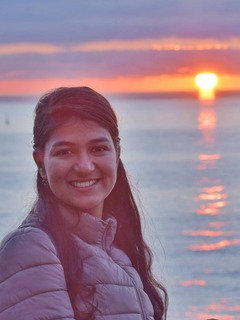

<link rel="stylesheet" href="https://cdnjs.cloudflare.com/ajax/libs/font-awesome/6.7.2/css/all.min.css">

  <a href="index.html" class="active">Home</a>
  <a href="ananya_cv.pdf" target="_blank">Resume</a>
  <a href="blogs.html">Blogs</a>

  

Hey there! 👋

I'm Ananya, a Master's student in Computer Science at EPFL in beautiful Lausanne, Switzerland, where I've now spent two years that somehow feel like two months.

**What I'm working on.** I'm currently working with Prof. Martin Jaggi (MLO Lab) and Prof. Volkan Cevher (LIONS Lab) at EPFL on making **Mixture-of-Experts (MoE) training more efficient**, exploring asynchronous and other approaches. MoE models are one of the most promising ways to scale LLMs, but training them at scale is hard: uneven load across experts and heavy communication between GPUs leave a lot of expensive hardware sitting idle. This sits right at the intersection I care about, where ML meets low-level systems.

I found that intersection during my third semester, working on a GPU-based database query engine at the DIAS lab. That meant getting deep into CUDA kernels, memory movement and GPU utilization, and I loved it. That work became a paper, *Tile-Based Decompression in Compiled GPU Engines*, which has been accepted at VLDB 2027.

Like it or not, LLMs are here to stay, and so are their costs: huge compute bills, a growing energy and climate footprint, and hardware that only a few can afford. We can't wish that future away, but we can make it far more efficient. I'm interested in making training and inference cheaper and faster everywhere, from data centers to laptops and edge devices.

It also showed me where I want to focus. Like it or not, LLMs are here to stay, and so are their costs: huge compute bills, a growing energy and climate footprint, and hardware that only a few can afford. We can't wish that future away, but we can make it far more efficient. I'm interested in making training and inference cheaper and faster everywhere, from data centers to laptops and edge devices.

**Where I've been.** Before EPFL, I spent four years as a Software Engineer III at Google Search. I helped migrate critical features of one of the world's most complex systems to a new microservices architecture, and co-developed an LLM-driven workflow that automates large-scale code migrations. More recently, I interned with Nexthink's AI team, building hybrid search and knowledge-graph approaches to make RAG systems retrieve the right information.

**AI for biology and medicine.** This still fascinates me. With the MLBIO lab at EPFL, I've worked on extending LUNA, a generative model that reconstructs tissue structure from gene expression data. Biomedical data is massive, detailed and deeply multimodal, which makes it a natural fit for efficiency research. I'd love to help build tools that let independent researchers, not only well-funded labs and companies, work with this data in a resource-efficient way.

**Beyond the code.** I love thinking and talking about life, emotions, relationships and what we're all here for, and I enjoy hearing perspectives different from mine. I'm an irregular but devoted reader: when something resonates, I can't put it down. I also love good food with balanced flavors, especially Indian and Mediterranean, and a really good pizza. Coffee is non-negotiable ☕

**Let's talk.** I got more questions on LinkedIn than I could keep up with, so I now take 1:1 sessions on [Topmate](https://topmate.io/ananya_gupta10). I'm happy to talk about applying for a Master's or studying in Europe, breaking into and interviewing at Google, or moving from industry back to research. If you'd rather not book a session, you can drop your question there too, and I'll do my best to help.

**The longer road.** Beyond my career, I want to do something that feeds my soul: work on real problems that touch people's lives, outside the machines. I care most about access to good-quality education and healthcare, and about making sure nobody has to struggle for the basics. I'm happy to explore these ideas on the side, and I'm open to building something of my own if the right idea clicks and I find the right people to build it with. If that sounds like you, I'd love to hear from you.

  <a href="https://linkedin.com/in/ananya94" target="_blank" title="LinkedIn"><i class="fab fa-linkedin"></i></a>
  <a href="https://twitter.com/ananyag12345" target="_blank" title="Twitter"><i class="fab fa-twitter"></i></a>
  <a href="https://github.com/ananya99" target="_blank" title="GitHub"><i class="fab fa-github"></i></a>
  <a href="https://people.epfl.ch/ananya.gupta?lang=en" target="_blank" title="EPFL Profile"><i class="fas fa-graduation-cap"></i></a>
  <a href="https://topmate.io/ananya_gupta10" target="_blank" title="Book a 1:1 on Topmate"><i class="fas fa-calendar-check"></i></a>
  <!-- Google Scholar: uncomment and paste your profile URL once the account is live -->
  <!-- <a href="https://scholar.google.com/citations?user=YOUR_ID" target="_blank" title="Google Scholar"><i class="fab fa-google-scholar"></i></a> -->

  📧 ananya (dot) gupta (at) epfl (dot) ch 
  📍 Lausanne, Switzerland

  

  

    
  

<meta name="google-site-verification" content="01294f8013167c77" />